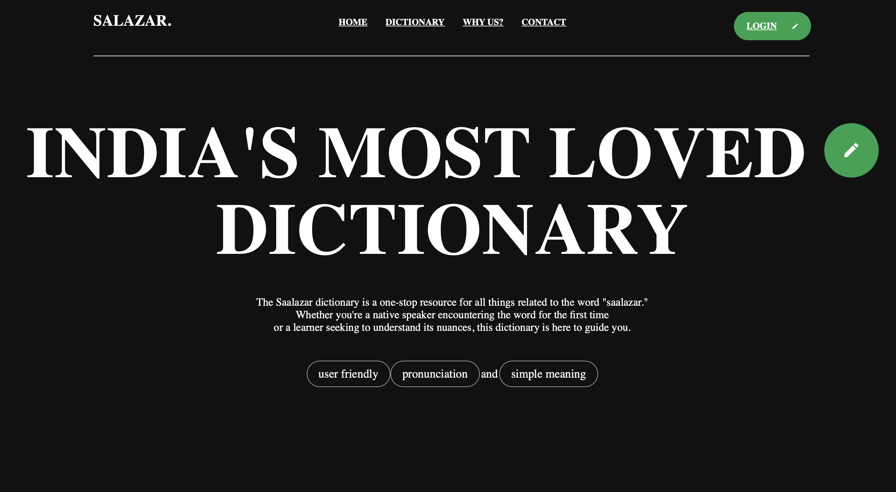
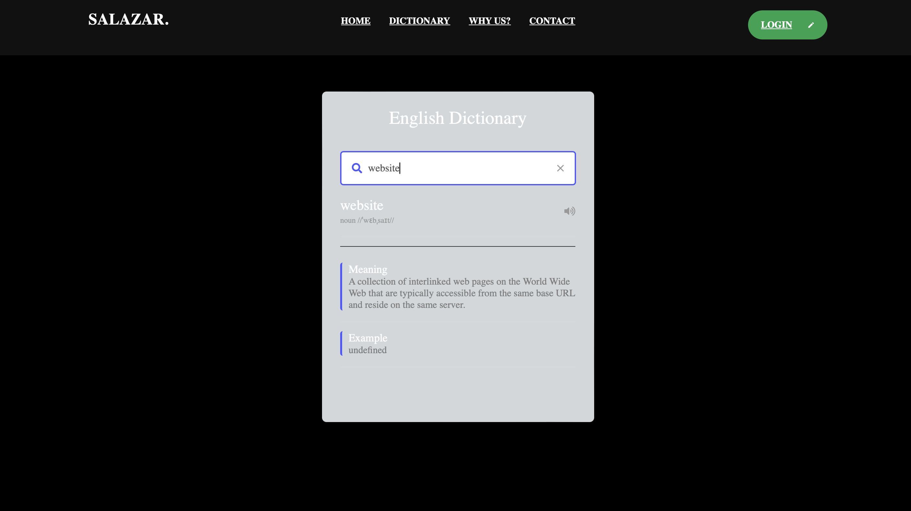
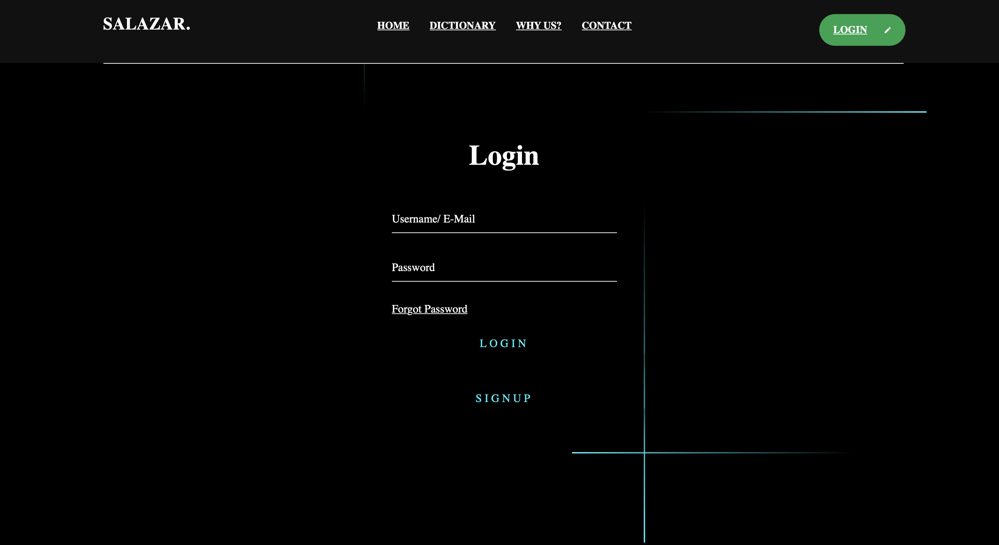
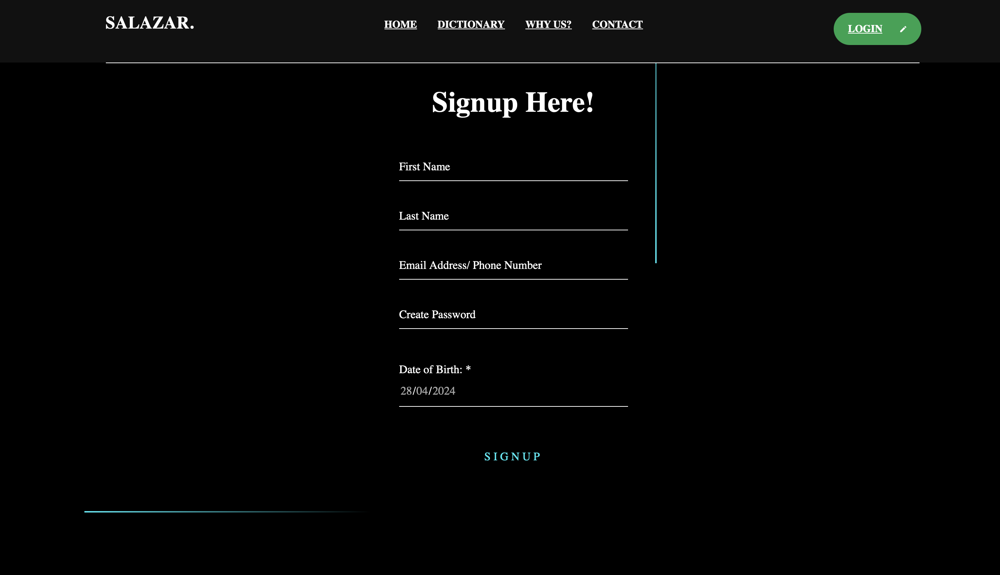
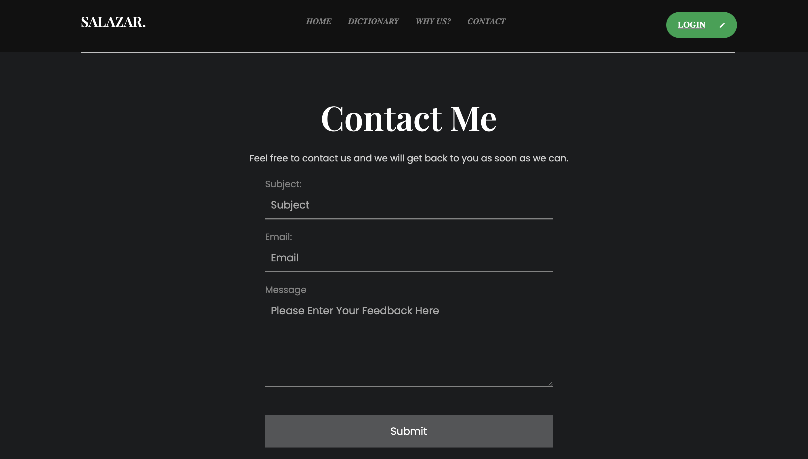
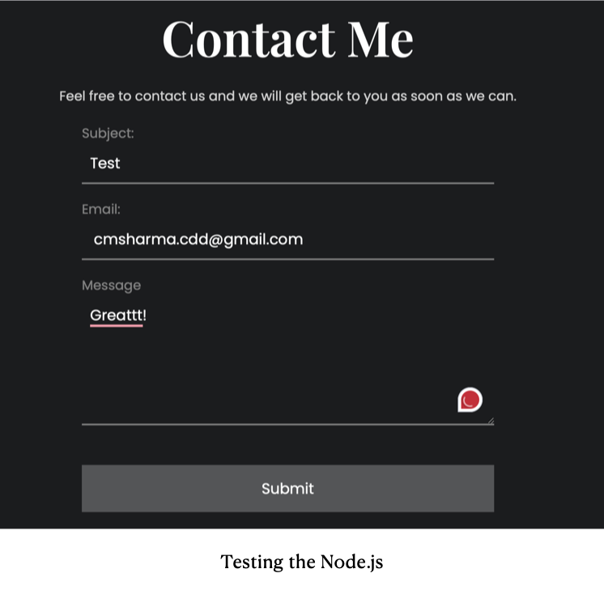
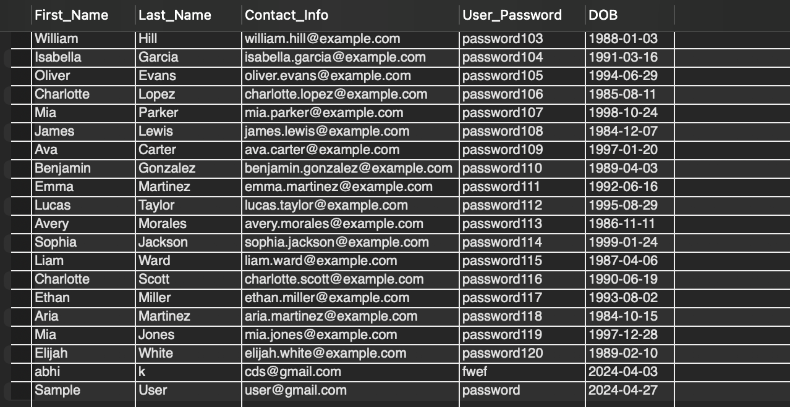
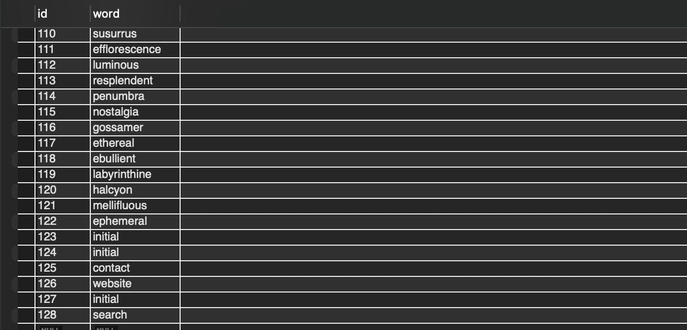
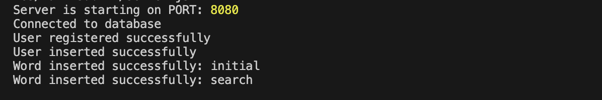

Salazar – English Dictionary

A full-stack English dictionary web application built using **HTML, CSS, JavaScript, AngularJS, Node.js, and MongoDB**, featuring database connectivity, dynamic word search, user authentication, and backend-powered contact functionality.


##  Project Overview

Salazar – English Dictionary is a complete web-based dictionary system that integrates both front-end and back-end technologies. The application allows users to search words dynamically, register and log in securely, and communicate via a contact form connected to a Node.js backend and database.


##  Features

- Dynamic English word search
- User registration and login system
- MongoDB database connectivity
- Node.js backend server
- Working Contact Us form with email delivery
- AngularJS-based alerts and page redirections
- Responsive UI design


##  Tech Stack

**Frontend**
- HTML
- CSS
- JavaScript
- AngularJS

**Backend**
- Node.js
- Express.js

**Database**
- MongoDB


  
##  Screenshots

### Dashboard


### Dictionary Page


### Login Page


### Signup Page


### Contact Page


### Contact Form – Node.js Working



##  Database Connectivity Testing

Successful MongoDB connection and operations including user registration and word insertion.






##  Node.js Connectivity Testing

Node.js server handling contact form requests and email delivery successfully.




##  How to Run the Project

1. Clone the repository:
   ```bash
   git clone https://github.com/diyakharb1029/Salazar-English-Dictionary.git
   ```

2. Install backend dependencies:

   ```bash
   npm install
   ```

3. Start the server:

   ```bash
   node server.js
   ```

4. Open frontend files in browser.

> Ensure MongoDB is running locally or connected via URI.


##  License

This project is licensed under the **MIT License**.


##  Contributer

**Made By Diya Kharb**
